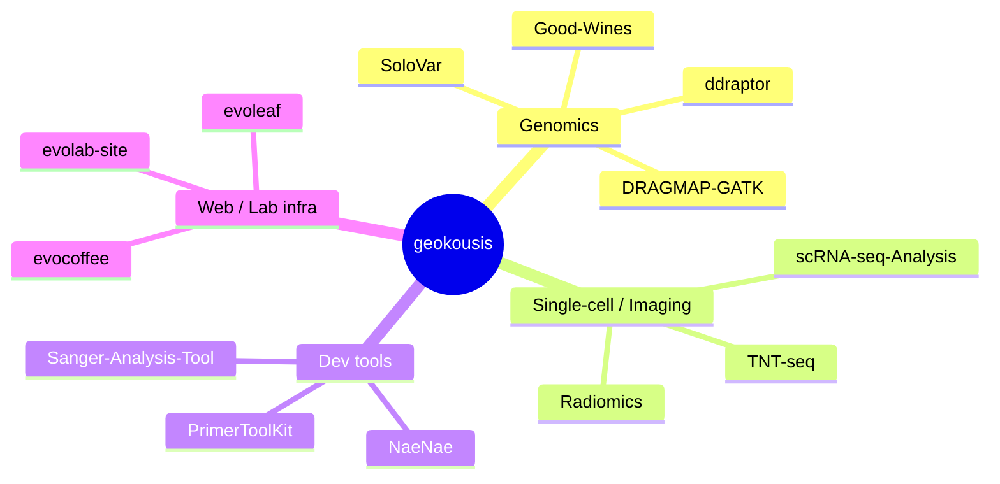

<!-- profile README for github.com/geokousis  →  repo must be named  geokousis/geokousis -->

<h1 align="center">Hi, I'm Georgios 👋</h1>

  <em>Bioinformatics @ University of Crete · building stuff that no one will use</em>

  <!-- dynamic cards; hide html/jupyter so the language mix reflects what you actually write -->
  
  

<!-- always-render fallback: static tech badges (these never break, unlike the cards above) -->

  
  
  
  
  

---

### 🧭 What I work on

---

### 🧬 Selected projects by domain

<b>Genomics & Variant Calling</b>

| Project | What it does | Lang |
|---|---|---|
| [SoloVar](https://github.com/geokousis/SoloVar) | Tumor-only variant calling & annotation | Python |
| [ddraptor](https://github.com/geokousis/ddraptor) | Optimal ddRAD enzyme-pair selection via in-silico digests | Rust |
| [Good-Wines](https://github.com/geokousis/Good-Wines) | SNP identification in *Vitis vinifera* | Python |

<b>Single-cell, Imaging & Analysis</b>

| Project | What it does | Lang |
|---|---|---|
| [scRNA-seq-Analysis](https://github.com/geokousis/scRNA-seq-Analysis) | Single-cell RNA-seq workflows | — |
| [Radiomics](https://github.com/geokousis/Radiomics) | Radiomic feature analysis | — |
| [BCProjects](https://github.com/geokousis/BCProjects) | Academic bioinformatics projects | Jupyter |

<b>Developer Tools</b>

| Project | What it does | Lang |
|---|---|---|
| [NaeNae](https://github.com/geokousis/NaeNae) | Wrap long commands, match regex, ping Discord | Rust |
| [PrimerToolKit](https://github.com/geokousis/PrimerToolKit) | Primer design toolkit | R |
| [evoleaf](https://github.com/geokousis/evoleaf) | Self-hosted Overleaf CE with extras | JS |

---

  🌐 <a href="https://geokousis.github.io">geokousis.github.io</a> ·
  🎓 University of Crete

